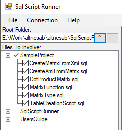
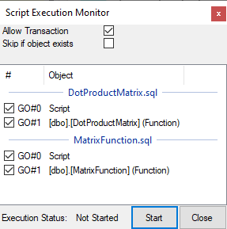

# Users Guide for Sql Script Runner

Original release.

Created By Csaba Nagy @2024

MIT license.

Project page on Github: [github.com/altncsab](https://github.com/altncsab/altncsab/blob/main/SqlScriptRunner/Readme.md)

## Releases

Date|Version|Description
-|-|-
2024.01.24|1.0.1-alpha01|Allow switch on / off transactions during script applying
2024.01.18|1.0.0.0|Adding Users guide
2024.01.16|1.0.0.0|Initial release

## Table of Content

- [Users Guide for Sql Script Runner](#users-guide-for-sql-script-runner)
  - [Releases](#releases)
  - [Table of Content](#table-of-content)
  - [Purpose of Application](#purpose-of-application)
  - [Starting up the application](#starting-up-the-application)
    - [Pre-requisite of starting up this application](#pre-requisite-of-starting-up-this-application)
    - [Initial appearance of the application](#initial-appearance-of-the-application)
  - [Usage of the application](#usage-of-the-application)
    - [Menu "File"](#menu-file)
    - [Menu "Save Content Generated" Ctrl+S](#menu-save-content-generated-ctrls)
  - [Menu "Connection"](#menu-connection)
    - [Menu "Connect To DB" (Alt+C C)](#menu-connect-to-db-altc-c)
    - [Menu "Disconnect" (Alt+C D)](#menu-disconnect-altc-d)
  - [Help (Alt+H)](#help-alth)
    - [Menu "About" (Alt+H A)](#menu-about-alth-a)
    - ["Users Guide" (F1 or Alt+H G)](#users-guide-f1-or-alth-g)
  - [Root folder selector](#root-folder-selector)
  - [File selector tree node](#file-selector-tree-node)
  - [Button "Make Script"](#button-make-script)
  - [Button "Apply To DB"](#button-apply-to-db)
  - [Script Execution Monitor](#script-execution-monitor)
    - [Checkbox "Allow Transaction"](#checkbox-allow-transaction)
    - [Button "Start"](#button-start)
    - [Button "Close"](#button-close)
  - [Closure and usage](#closure-and-usage)
  - [Planned features in the future](#planned-features-in-the-future)

## Purpose of Application

This application is applying selected SQL script to the targeted database.

The script file are analyzed and applied to the configured database sorting the files in specific order to make the script implementation problem free.

The application is slicing up all selected script file over GO command. Application is considering commented codes and recognizing if a "GO" in an out commented region. Scripts are handled by GO sections and by file. If the script file is containing multiple object type creation the higher priority script file will execute first.

Some of the common problems the implementer may face are not handled in this application. They are like:

- No automatic dropping of function or procedure if there is already an object in database with the same name. (But considering to have this option.)
- No automatic SQL user type reassignment to procedure, table, function if the user defined type has a change. (But considering to implement option to handle it.)
- No automatic dropping, and re-creation for SQL Tables. This is a sensitive topic and it may require more robust preparation based on the situation.
- There is a transaction started and completed during script insertion operation what could influence the likelihood of a successful scrip implementation. (Considering to implement option to switch off the transaction)
- No automatic sequence change within a single file. (Considering a kind of mechanism to correct sequence issues in the future)

## Starting up the application

There is no installer currently employed and the executable is not signed. That could rase some security concern what may requires actions on antivirus softwares.

### Pre-requisite of starting up this application

- On Windows: .Net SDK 4.8.2
- On Linux: Mono, .Net Core 6 or above. optionally with Vine .Net Framework installed.

It is advice to have an SQL server connection available to explore the full functionality of the application.

### Initial appearance of the application

When the application starting up it is scanning of the home folder of the user and looking for SQL script files (.sql). If any of the subfolder contains such a file it will be opened and all files will be shown and checked. That operation may take some time and the form does not showing up before it is finished. (considering to change this behavior)

The top section of the form contains a menu bar with file operation and database connection features. (The "Help" section does not implemented yet.)

Left side sidebar contains options for operations. The right side of the form is a general purpose reach text box to showing information to the current operation.

The bottom of the form contains a status bar information.

The screen coverage rate by the side bar and the information box can be changed with mouse by pulling the border area left and right.

## Usage of the application

### Menu "File"

It contains file operation options. Right now only the saving of the generated content. This is anything appearing in the text box at the side of the screen.

### Menu "Save Content Generated" Ctrl+S

The menuitem opens a Save Generated Script sub form where the user can save the current content of the big text box at the right side of the screen. The form is a standard save file form what is pointing to the user's Documents folder by default. The form is supporting extensions with sql, txt and any other type. The user must enter a file name before allow to press "Save" button.

## Menu "Connection"

Inside this menu item user can connect and disconnect to a database.

### Menu "Connect To DB" (Alt+C C)

The sub form "Connect To Database" will open. The user can define database server connection, If the connection should use integrated security therefore "Is Trusted". What is the initial catalog name. If the connection does not trusted the user can define SQL user name and password. Active Directory integration right now not supported.

User can enter the Database name or (if the access right granted on Master fot the configured user) can query available Databases for selection inside the dropdown box.

If user has selected a database the "Save" button become available and the configured server and database will be visible in the main header section of the main form.

The header of the form after saved:

The button "Apply To DB" becomes also active.

The application does not check if the configuration is valid and if the configured user really has the access required. This will turn out first after we have started a database related action.

### Menu "Disconnect" (Alt+C D)

It is clearing the configured database connection from the application. The database indication from the form header disappears and the button "Apply To DB" become disabled.

## Help (Alt+H)

It contains the about box and the users guide.

### Menu "About" (Alt+H A)

Showing the application name, version and author information.

### "Users Guide" (F1 or Alt+H G)

Loading and showing the users guide. It is a web component. Ctr+F is opening a search window. Links are clickable. Loading the users guide from the application is a bit time consuming. The form showing message: "Loading document. Please wait!"

## Root folder selector

The user can manually enter a new path:

In this case the system suggest valid folder names. If valid folder path entered the tree view of the folder structure will be rebuild based on the new data. This may makes the application unresponsive for several seconds.

The button with tha character hat (^) changes the current folder to the parent folder of the currently configured.

The button with three dots (...) opens a folder selector sub form to pick a subfolder from the local machine scoop.

When ever the application finds files with sql extension it checks them for processing. It makes is wise to choose the parent folder parent to have better control authority over what should be checked.

## File selector tree node

The file selector tree node showing the "Root Folder" directory structure and any files has .sql extension. It is also looking inside the first level child folder if it has and .sql file inside. if it finds anything, it opens up that node and checks all the sql files inside. This mechanism is also working when user is opening up a subfolder.

By pressing the checkbox of the file item, inverts the check marking. By pressing the check box on the parent folder (any level) will copy the check status to all child elements but only of that sub folders where any of the child folder has SQL files inside.

Double clicking on any of the subfolder name makes the clicked item as root folder and rebuilds the tree node structure. The already existing check configuration will be lost.

Selecting Tree node item loading and placing the file content to the text area by overwriting what ever was there before. (Save to file what ever is important to be kept!)

## Button "Make Script"

Anytime user presses this button based on the selected files the application is creating a merged script with GO separation inside the text area. User can save this generated script to file and use it up later on a different application. Some new line characters can appear extra as the script reconstructed after analysis. This script showing the planned execution order for "DB Apply" mode and all the future features scripting result too.

## Button "Apply To DB"

If a database is configured this button become active. By pressing it a new sub form "Script Execution Monitor" is opening.

## Script Execution Monitor

In the top part showing up some settings and the Script Execution status. In the list view control we see all selected files as groups and "GO" sections inside. The order of the group is matching the file execution order. The column with hash (#) indicating the GO count inside the file. The Object column is the object name with the creation and the object type classification or if there is no clear script type than it is classifying the scrip section as "Script". Script classification is where certain object creation is happening. It is like Function, Procedure, Type, Table, View.

### Checkbox "Allow Transaction"

This setting determines if the application should start a transaction when it starts to deploy the configured script sections.

Default value: checked

### Button "Start"

It is staring the Script execution sequence. The tool applying the scripts to the database using transaction. If any of the script section is failing to execute the script section will be marked red and all the previous actions will be rolled back. During script execution the script what is currently executing is marked with Orange color. The one is completed with success is marked with green color. The failed ones are marked with red color. If the execution is canceled the color will be light gray. When the execution  The execution log text for each script section is available as a tooltip box when mouse hoovering over the script section item. The full execution log is also logged to the Text area with time stamp. All print command will be also visible but the result of the select commands are not loaded.

Ongoing Execution:

Passed Execution Log:

Failed Execution:

### Button "Close"

It is closing / cancelling the ongoing script execution. it is pressed during an ongoing sequence execution, the currently running scrip will be canceled at the SQL server side and all previous action will be rolled back.

It looks like this:

The meaning of the ERROR in english "The current command resulted in a fatal error. The results (if any) cannot be used. The operation was canceled by the user." what is coming from the SQL server based on the language setting.

## Closure and usage

The application is build for demonstration purpose. There is no guarantee it is working for every scenario. Please use it with caution. I could not accept any responsibility if the tool cause any issue or damage in your targeted database.

## Planned features in the future

- Auto script drop statement if user asking for it.
- Comment analysis result to the header of generated script (Like missing object or risk of failure.)
- Checkbox to include / exclude script section in Execution monitor
- Option to mark script item as skip if object already exists in Database
- Option to allow inject drop statement if object already exists
- Maybe a recreation procedure for type alteration problem, when a type in use but it must be changed. Those referenced object needs to be scripted dropped and recreated with the new type definition!

Email me if you have any other idea for make the tool better for your purpose.
